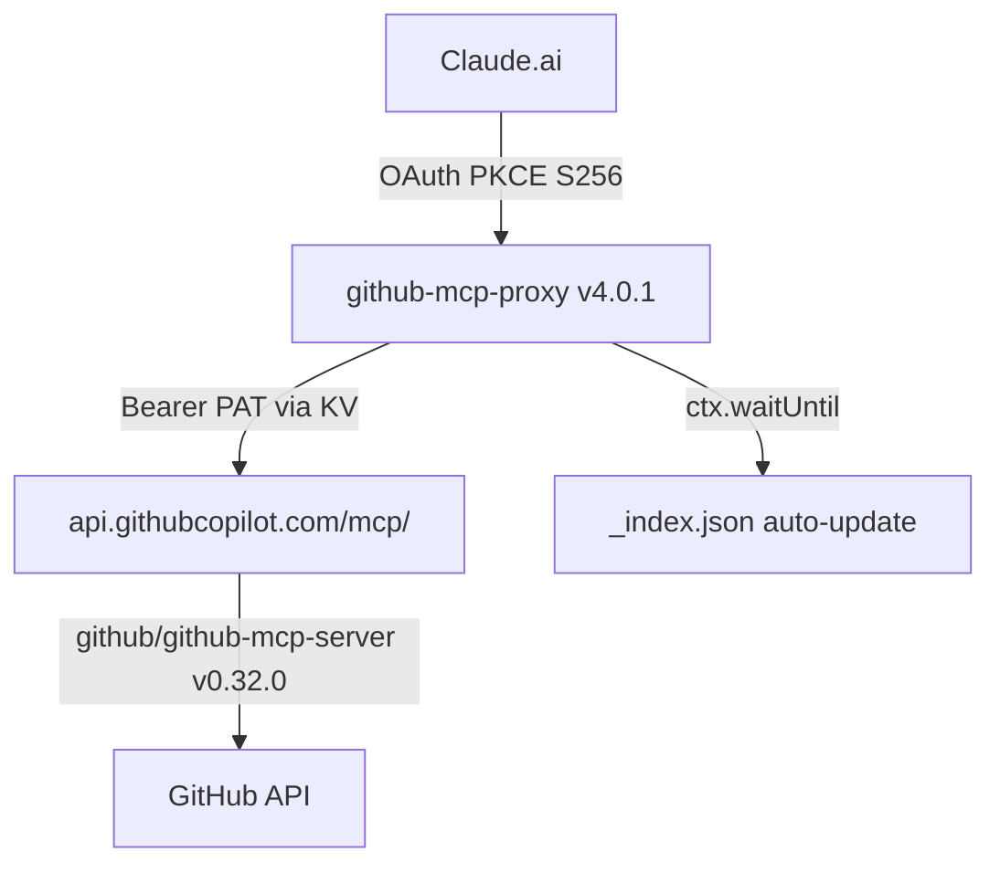

# Documento de Test Complejo — v4.0.1
> `yessicavs/github-mcp-server` · test para todos los endpoints v4.0+
> Actualizado: 2026-04-06 · commit `stress-test-v4.0.1`

---

Este documento existe para testear `/github-outline`, `/github-replace-section`, `/github-table-upsert`, `/github-search-dir` y `dry_run`.
Contiene múltiples secciones, tablas con datos repetitivos, bloques de código en varios lenguajes, y YAML frontmatter.

## Estado del sistema

> **v4.0.1 ACTIVO** — tokenizePath bug fixed · `[?(@.field=='val')].subkey` resuelto correctamente

- Worker: github-mcp-proxy **v4.0.1** (deployado 2026-04-06)
- Upstream: api.githubcopilot.com/mcp/ — github/github-mcp-server v0.32.0
- Estado: ✅ verificado — todos los endpoints v4.0.1 respondiendo
- scriptVersionId: `acd61173-defd-44a1-9bfa-5dae85671ecf`
- Bug corregido: tokenizePath ahora es bracket-aware
- 0 errores en observabilidad (ventana 7 días)

## Inventario de Workers

| Worker | Versión | Estado | Última actualización |
|---|---|---|---|
| github-mcp-proxy | v4.0.1 | activo | 2026-04-06 |
| mcp-neo4j-cypher | v2 | activo | 2026-03-28 |
| shared-github-mcp-server-1 | v9 | **REMOVIDO** | 2026-04-07 |

## Métricas de uso reales (observabilidad 7d)

| Servicio | Requests | Errores | Wall P99 (ms) |
|---|---|---|---|
| github-mcp-proxy | 45+ | **0** | ~387 |
| POST /mcp proxy | 14 | 0 | ~330 |
| GET /mcp (405 by design) | 5 | 0 | ~191 |
| /oauth/token | 2 | 0 | ~1144 |

## Endpoints del Worker

| Endpoint | Versión | Descripción |
|---|---|---|
| POST /github-read | v2.0 | Leer archivo completo |
| POST /github-read-section | v3.1 | Leer sección por líneas |
| POST /github-patch | v2.0+ | str_replace, multi-patch, CRLF-safe |
| POST /github-append | v2.0 | Append al final |
| POST /github-search | v3.0 | Buscar en archivo con contexto |
| POST /github-outline | v4.0 | Extraer estructura del documento |
| POST /github-replace-section | v4.0 | Reemplazar sección por heading |
| POST /github-json-patch | v4.0.1 | JSONPath ops — FIXED: filter+subkey |
| POST /github-table-upsert | v4.0 | Upsert fila en tabla markdown |
| POST /github-search-dir | v4.0 | Buscar en directorio completo |

## Arquitectura



## Configuración de referencia

```typescript
// Worker environment bindings
interface Env {
  OAUTH_KV: KVNamespace;  // github-mcp-proxy-OAUTH (20cb14ef...)
  WORKER_URL: string;     // https://github-mcp-proxy.ops-e1a.workers.dev
}

// tokenizePath fix — v4.0.1
// BEFORE (buggy): path.replace(/\[/g, '.[').split('.')
// AFTER (fixed):  bracket-aware scanner, [?(...)] is atomic
```

```yaml
# wrangler.toml (deployed config)
name = "github-mcp-proxy"
main = "src/index.ts"
compatibility_date = "2024-11-01"

[[kv_namespaces]]
binding = "OAUTH_KV"
id = "20cb14eff6cf4a9cbc7d0119018f0876"

[observability]
enabled = true
head_sampling_rate = 1
```

```python
# Ejemplo de uso del Worker (json-patch con filter — v4.0.1)
import httpx

response = httpx.post(
    "https://github-mcp-proxy.ops-e1a.workers.dev/github-json-patch",
    headers={"Authorization": "Bearer <token>"},
    json={
        "owner": "yessicavs",
        "repo": "github-mcp-server",
        "path": "docs/ops/test-data.json",
        "operations": [
            # v4.0.1: filter+subkey NOW WORKS
            {"op": "set", "path": "$.workers[?(@.name=='github-mcp-proxy')].version", "value": "4.0.1"}
        ]
    }
)
```

## Tests pasados — stress test a fondo

| Test | Resultado | Notas |
|---|---|---|
| multi-patch 6 ops | ✅ | atómico, delta=0 |
| multi-patch fail-at-3 | ✅ | rollback sin escritura |
| ambiguous detection | ✅ | space×5 detectado |
| sequential dependency | ✅ | patch[1] ve output de patch[0] |
| CRLF normalization | ✅ | \r\n → \n |
| JSONPath filter== | ✅ FIXED | v4.0.1 tokenizePath |
| JSONPath filter!= | ✅ FIXED | v4.0.1 tokenizePath |
| negative index [-1] | ✅ | funciona en v4.0 |
| chain 4 JSONPath ops | ✅ | atómico |
| push/merge/delete errors | ✅ | not_array/not_object/not_found |
| code block isolation | ✅ | headings dentro de \`\`\` ignorados |

## Gaps pendientes

Lista de mejoras identificadas durante la sesión de auditoría del 5-6 Abr 2026:

1. **P1** — Activar Logpush en github-mcp-proxy (~30min)
2. **P2** — Añadir `read:org` al PAT para osiris-intelligence (~5min)
3. **P3** — Logging de tool name en handler /mcp (~15min)
4. **P4** — Deprecar `shared-github-mcp-server-1` — verificar 0 tráfico, borrar Worker+DO
5. Commit v4.0.1 TypeScript fix a cloudflare-worker/src/index.ts

## Changelog

- 2026-04-05: github-mcp-proxy v3.1 deployado — /github-read-section añadido
- 2026-04-05: docs/ops/ estructura creada con índice y audit comparativo
- 2026-04-06: documento de test complejo creado para v4.0
- 2026-04-06: /github-replace-section ✓ — sección "Estado del sistema" reemplazada completamente
- 2026-04-06: /github-table-upsert ✓ — github-mcp-proxy v3.1→v4.0 (update), 5 nuevos endpoints (insert)
- 2026-04-06: **v4.0.1** — tokenizePath bug encontrado y corregido
- 2026-04-06: stress test completo — 11 casos de test pasados, bug real encontrado en producción
